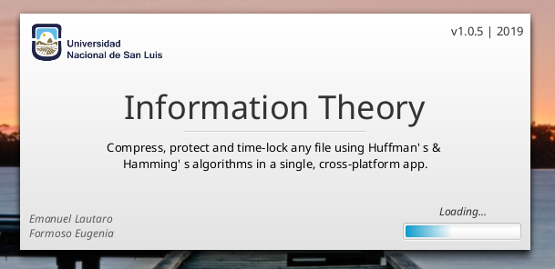
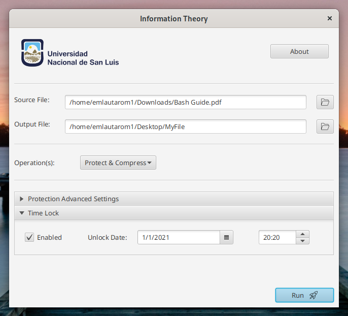

# Information Theory

---

Cross-platform Desktop App for data Protection and Compression using Hamming's and Huffman's algorithms.

Tested on Windows 10 and Linux (Fedora 36).





## Requirements

- JDK 8

## Building

```
$ git clone --recursive https://github.com/emlautarom1/InformationTheory.git
$ cd InformationTheory
# To run the app
$ ./gradlew run
# To build a standalone JAR
$ ./gradlew jar
```

## References

- J. Vaughan (2013). Hamming code example
- R. Sedgewick, K. Wayne (2011). Algorithms (4th ed.). Addison-Wesley Professional
